# Modelo de estimação de notas do ENEM 2023

## Metodologia

### Objetivo do modelo

Este repositório contém um modelo de machine learning desenvolvido para estimar as notas do ENEM 2023 com base em dados demográficos e socioeconômicos dos participantes. O foco inicial é no estado de Goiás, utilizando o algoritmo XGBoost para prever as notas nas diferentes áreas do exame.

### Delimitação do modelo

O modelo refere-se as notas do ENEM 2023 para o estado de Goiás, com base em dados coletados pelo INEP. O objetivo é analisar como variáveis como idade, gênero, renda familiar e escolaridade dos pais influenciam o desempenho dos estudantes.

### Contextualização do problema

O Exame Nacional do Ensino Médio (ENEM) é uma das principais formas de avaliação educacional no Brasil, influenciando o acesso ao ensino superior. Compreender os fatores que impactam o desempenho dos estudantes pode ajudar a identificar desigualdades e orientar políticas educacionais.

Neste contexto, é fundamental analisar como variáveis demográficas e socioeconômicas influenciam as notas dos participantes. Este modelo visa fornecer insights valiosos para educadores, formuladores de políticas e pesquisadores interessados em melhorar a qualidade da educação no país.

### Gerenciamento de dados

Os dados utilizados neste projeto foram obtidos do [INEP](https://www.gov.br/inep/pt-br/areas-de-atuacao/avaliacao-e-exames-educacionais/enem) e incluem informações detalhadas sobre os participantes do ENEM 2023, como idade, gênero, renda familiar, nível de escolaridade dos pais, entre outros. O pré-processamento dos dados envolveu a limpeza, transformação e seleção das variáveis mais relevantes para a modelagem.

Em relação a amostra utilizada foram considerados participantes do ENEM 2023 que residem no estado de Goiás, que estavama presentes em todas as provas do ENEM 2023, incluindo Linguagens e Códigos, Matemática, Ciências Humanas e Ciências da Natureza, que responderam o questionário socioeconômico e que tiveram suas notas divulgadas pelo INEP e que não apresentaram notas zeradas ou faltantes.

A análise exploratória dos dados foi realizada para entender a distribuição das notas e a correlação entre as variáveis, utilizando visualizações gráficas e estatísticas descritivas.

Os dados passaram por transformações, incluindo normalização e codificação de variáveis categóricas, para garantir a compatibilidade com o algoritmo XGBoost.

Outro ponto de transformação de dados foi a utilização da média das provas do ENEM 2023, que foi calculada como a média aritmética das notas obtidas nas provas de Linguagens e Códigos, Matemática, Ciências Humanas e Ciências da Natureza. Essa média foi utilizada como variável alvo para o modelo de machine learning.

Além das variaveis contidas no questionário socioeconômico, foram adicionadas variáveis externas, como o Índice de Desenvolvimento Humano (IDH) do município de residência dos participantes e o percentual de uso do programa Bolsa Familia no ano de 2023, para enriquecer a análise.

Para selecionar as amostras mais relevantes foi utilizada a técnica SelectKBest, que ajudou a identificar as variáveis com maior impacto nas notas do ENEM.

### Delimitação do modelo

O modelo refere-se as notas do ENEM 2023 para o estado de Goiás, com base em dados coletados pelo INEP. O objetivo é analisar como variáveis como idade, gênero, renda familiar e escolaridade dos pais influenciam o desempenho dos estudantes.

### Contextualização do problema

O Exame Nacional do Ensino Médio (ENEM) é uma das principais formas de avaliação educacional no Brasil, influenciando o acesso ao ensino superior. Compreender os fatores que impactam o desempenho dos estudantes pode ajudar a identificar desigualdades e orientar políticas educacionais.

Neste contexto, é fundamental analisar como variáveis demográficas e socioeconômicas influenciam as notas dos participantes. Este modelo visa fornecer insights valiosos para educadores, formuladores de políticas e pesquisadores interessados em melhorar a qualidade da educação no país.

### Gerenciamento de dados

Os dados utilizados neste projeto foram obtidos do [INEP](https://www.gov.br/inep/pt-br/acesso-a-informacao/dados-abertos/microdados/enem) e incluem informações detalhadas sobre os participantes do ENEM 2023, como idade, gênero, renda familiar, nível de escolaridade dos pais, entre outros. O pré-processamento dos dados envolveu a limpeza, transformação e seleção das variáveis mais relevantes para a modelagem.

Em relação a amostra utilizada foram considerados participantes do ENEM 2023 que residem no estado de Goiás, que estavama presentes em todas as provas do ENEM 2023, incluindo Linguagens e Códigos, Matemática, Ciências Humanas e Ciências da Natureza, que responderam o questionário socioeconômico e que tiveram suas notas divulgadas pelo INEP e que não apresentaram notas zeradas ou faltantes.

A análise exploratória dos dados foi realizada para entender a distribuição das notas e a correlação entre as variáveis, utilizando visualizações gráficas e estatísticas descritivas.

Os dados passaram por transformações, incluindo normalização e codificação de variáveis categóricas, para garantir a compatibilidade com o algoritmo XGBoost.

Outro ponto de transformação de dados foi a utilização da média das provas do ENEM 2023, que foi calculada como a média aritmética das notas obtidas nas provas de Linguagens e Códigos, Matemática, Ciências Humanas e Ciências da Natureza. Essa média foi utilizada como variável alvo para o modelo de machine learning.

Além das variaveis contidas no questionário socioeconômico, foram adicionadas variáveis externas, como o Índice de Desenvolvimento Humano (IDH) do município de residência dos participantes e o percentual de uso do programa Bolsa Familia no ano de 2023, para enriquecer a análise.

Para selecionar as amostras mais relevantes foi utilizada a técnica SelectKBest, que ajudou a identificar as variáveis com maior impacto nas notas do ENEM.

📊 Histograma variável target

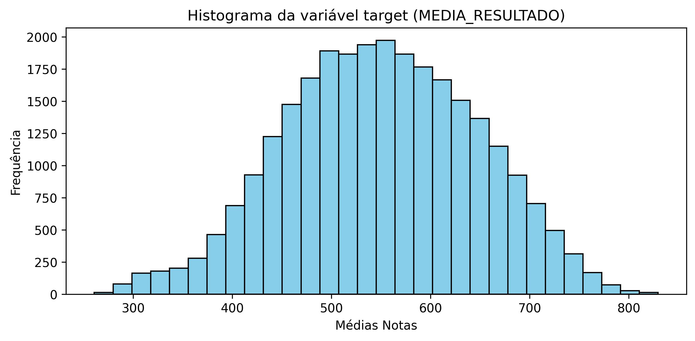

📊 Correlograma

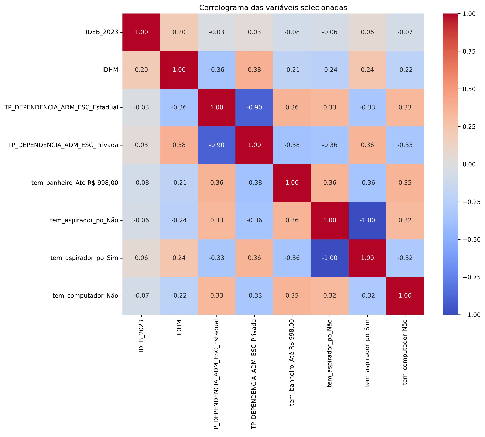

📊 Feature importance 

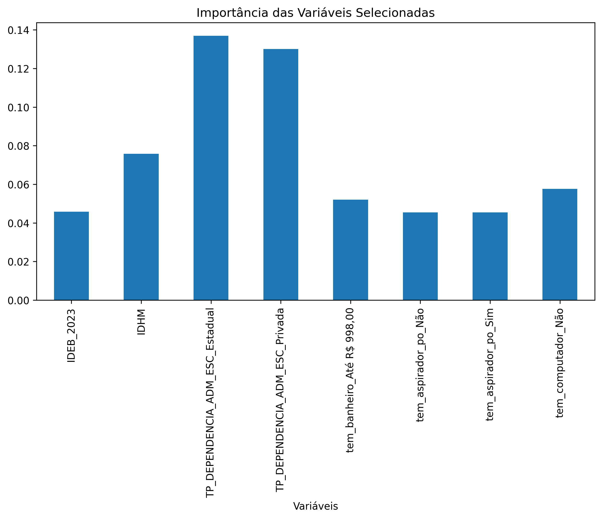

#### Análise dos dados

A análise dos dados revelou que as variáveis mais significativas para a previsão das notas do ENEM incluem:

- Idade: A idade dos participantes mostrou uma correlação positiva com as notas, indicando que estudantes mais velhos tendem a obter notas mais altas.
- Escolaridade: A escolaridade dos participantes e de seus pais teve um impacto significativo nas notas, com estudantes cujos pais possuem nível superior apresentando notas mais altas.
- Localização: A localização geográfica dos participantes também influenciou as notas, com estudantes de áreas urbanas apresentando desempenho superior em comparação com aqueles de áreas rurais.
- Renda familiar: A renda dos participantes mostrou uma correlação positiva com as notas, indicando que estudantes de famílias com maior renda tendem a obter notas mais altas.
- Escolaridade dos pais: A escolaridade dos pais também teve um impacto significativo, com estudantes cujos pais possuem nível superior apresentando notas mais altas.
- Gênero: A análise revelou diferenças de desempenho entre gêneros, com meninas apresentando notas ligeiramente superiores em algumas áreas.

### Premissas

O modelo assume que as variáveis demográficas e socioeconômicas têm um impacto significativo nas notas do ENEM, e que esses dados são representativos da população de estudantes do estado de Goiás.

O modelo também assume que a média das notas das provas do ENEM 2023 é uma métrica válida para avaliar o desempenho dos estudantes.

### Descrição da técnica de Machine Learning

O modelo utiliza o algoritmo XGBoost, que é uma implementação eficiente do gradient boosting. Este algoritmo é conhecido por sua capacidade de lidar com grandes volumes de dados e por sua eficácia em tarefas de regressão e classificação.

O XGBoost foi escolhido devido à sua robustez e capacidade de lidar com dados complexos, além de permitir a interpretação dos resultados através da importância das variáveis.

O modelo foi treinado utilizando validação cruzada para garantir a generalização e evitar overfitting. As métricas de desempenho incluem o erro médio absoluto (MAE) e Erro absoluto médio percentual (MAPE).

### Identificação da tecnica

A técnica de machine learning utilizada é o XGBoost, que é uma implementação eficiente do gradient boosting. Este algoritmo é amplamente utilizado em competições de ciência de dados devido à sua eficácia em tarefas de regressão e classificação.

### Fundamentação teórica

O XGBoost é baseado na técnica de boosting, que combina múltiplos modelos fracos para criar um modelo forte. Ele utiliza árvores de decisão como base, onde cada árvore é treinada para corrigir os erros da árvore anterior.

### Forma de representação do modelo

O modelo é representado por um conjunto de árvores de decisão, onde cada árvore contribui para a previsão final. A importância das variáveis é calculada com base na redução do erro que cada variável proporciona ao modelo.

Conforme apresentado pelos shapley values, as variáveis mais importantes para o modelo incluem a renda familiar, a escolaridade dos pais e o gênero dos participantes. Essas variáveis tiveram um impacto significativo nas previsões das notas do ENEM.

### Homologação dos resultados

Os resultados do modelo foram validados utilizando um conjunto de dados de teste separado, garantindo que o modelo não estivesse superajustado aos dados de treinamento. As métricas de desempenho foram comparadas com benchmarks do setor para garantir a confiabilidade dos resultados.

📊 Comparativo histogramas estimação x reais 

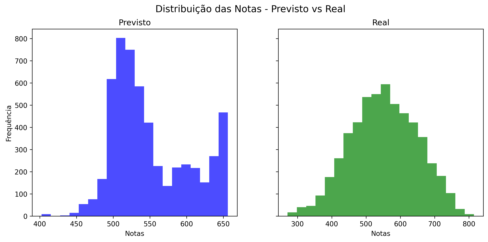

📊 Comparativo estimação x reais 

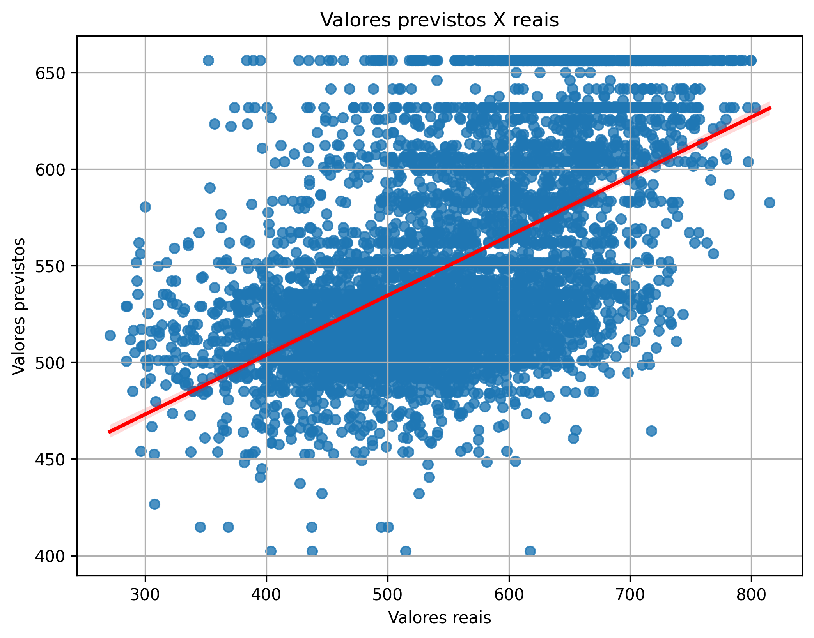

📊 Comparativo valores residuos 

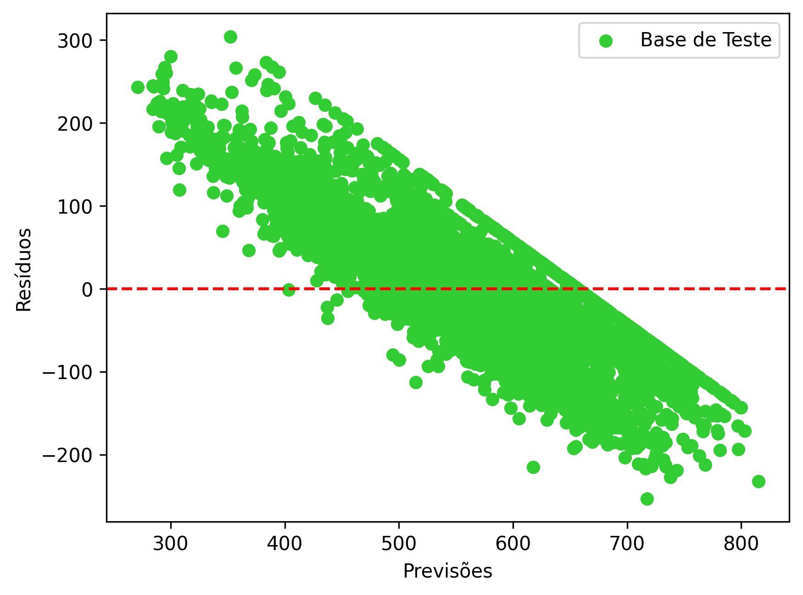

### Limitações do modelo

O modelo pode ser limitado pela qualidade e representatividade dos dados utilizados. Além disso, a complexidade do XGBoost pode dificultar a interpretação dos resultados para usuários não familiarizados com técnicas avançadas de machine learning.

### Premissas

O modelo assume que as variáveis demográficas e socioeconômicas têm um impacto significativo nas notas do ENEM, e que esses dados são representativos da população de estudantes do estado de Goiás.

O modelo também assume que a média das notas das provas do ENEM 2023 é uma métrica válida para avaliar o desempenho dos estudantes.

### Descrição da técnica de Machine Learning

O modelo utiliza o algoritmo XGBoost, que é uma implementação eficiente do gradient boosting. Este algoritmo é conhecido por sua capacidade de lidar com grandes volumes de dados e por sua eficácia em tarefas de regressão e classificação.

O XGBoost foi escolhido devido à sua robustez e capacidade de lidar com dados complexos, além de permitir a interpretação dos resultados através da importância das variáveis.

O modelo foi treinado utilizando validação cruzada para garantir a generalização e evitar overfitting. As métricas de desempenho incluem o erro médio absoluto (MAE) e Erro absoluto médio percentual (MAPE).

### Identificação da tecnica

A técnica de machine learning utilizada é o XGBoost, que é uma implementação eficiente do gradient boosting. Este algoritmo é amplamente utilizado em competições de ciência de dados devido à sua eficácia em tarefas de regressão e classificação.

### Fundamentação teórica

O XGBoost é baseado na técnica de boosting, que combina múltiplos modelos fracos para criar um modelo forte. Ele utiliza árvores de decisão como base, onde cada árvore é treinada para corrigir os erros da árvore anterior.

### Forma de representação do modelo

O modelo é representado por um conjunto de árvores de decisão, onde cada árvore contribui para a previsão final. A importância das variáveis é calculada com base na redução do erro que cada variável proporciona ao modelo.

Conforme apresentado pelos shapley values, as variáveis mais importantes para o modelo incluem a renda familiar, a escolaridade dos pais e o gênero dos participantes. Essas variáveis tiveram um impacto significativo nas previsões das notas do ENEM.

📊 Summary-plot 

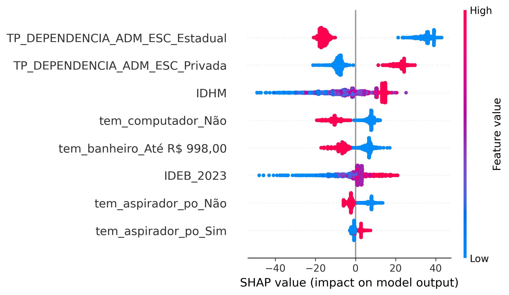

📊 Global-plot 

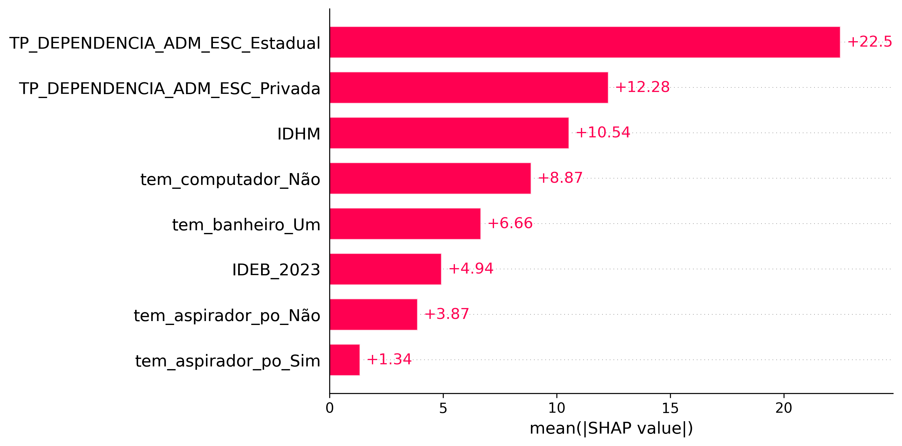

📊 Waterfall-plot 

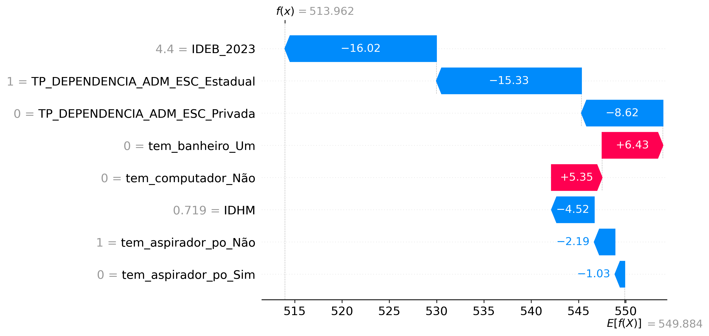

📊 Violin-plot 

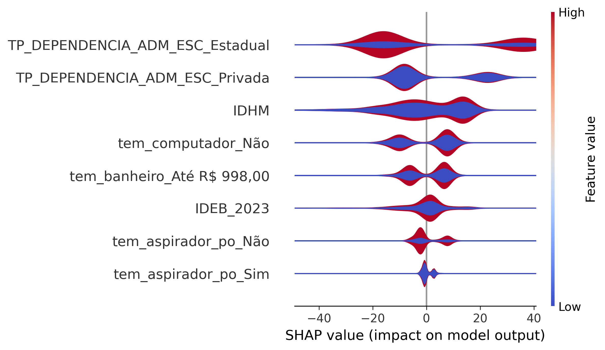

📊 Scatter-plot-IDHM 

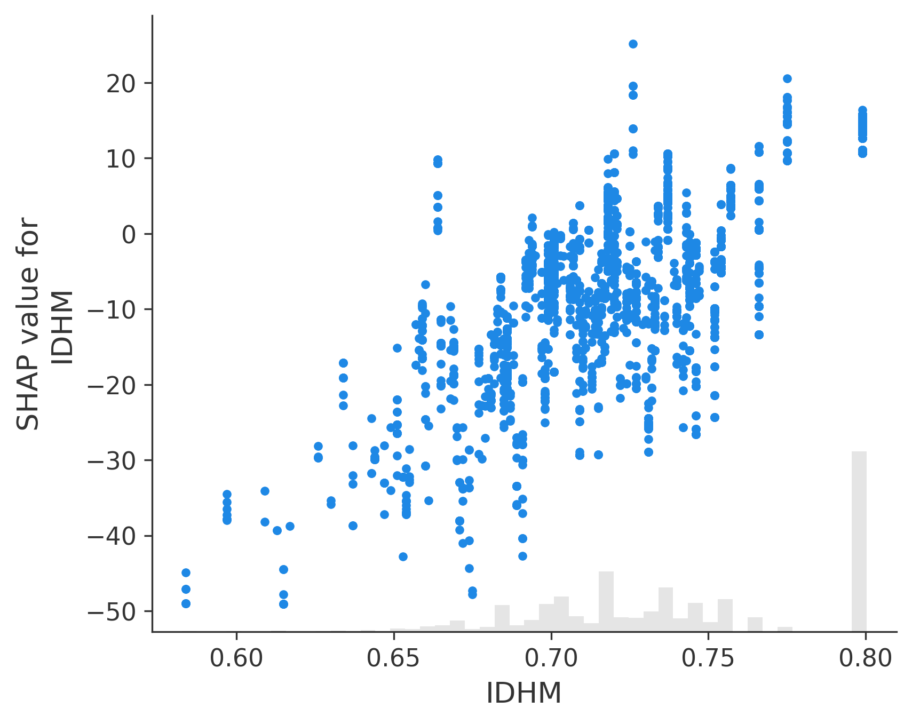

### Homologação dos resultados

Os resultados do modelo foram validados utilizando um conjunto de dados de teste separado, garantindo que o modelo não estivesse superajustado aos dados de treinamento. As métricas de desempenho foram comparadas com benchmarks do setor para garantir a confiabilidade dos resultados.

### Limitações do modelo

O modelo pode ser limitado pela qualidade e representatividade dos dados utilizados. Além disso, a complexidade do XGBoost pode dificultar a interpretação dos resultados para usuários não familiarizados com técnicas avançadas de machine learning.

## Entorno tecnológico

### Ambiente tecnológico utilizado

O modelo foi desenvolvido em um ambiente Python, utilizando bibliotecas como Pandas para manipulação de dados, Scikit-learn para pré-processamento e validação cruzada, e XGBoost para a modelagem. O ambiente de desenvolvimento utilizado foi o Jupyter Notebook.

O modelo foi desenvolvido em um ambiente Python, utilizando bibliotecas como Pandas para manipulação de dados, Scikit-learn para pré-processamento e validação cruzada, e XGBoost para a modelagem. O ambiente de desenvolvimento utilizado foi o Jupyter Notebook.

### Ciclo de processamento de dados:

O ciclo de processamento de dados incluiu as seguintes etapas:

1. Coleta de dados: Obtenção dos dados do INEP.
2. Pré-processamento: Limpeza e transformação dos dados, incluindo a normalização e codificação de variáveis categóricas.
3. Análise exploratória: Visualização e análise estatística das variáveis.
4. Modelagem: Treinamento do modelo XGBoost utilizando validação cruzada.
5. Avaliação: Cálculo das métricas de desempenho, como MAE e MAPE.
6. Interpretação: Análise da importância das variáveis e dos resultados do modelo.

### Armazenamento de dados:

Os dados foram armazenados em arquivos CSV no diretório `datasets/`, permitindo fácil acesso e manipulação. O modelo treinado e os resultados das previsões também foram salvos em formato pickle para facilitar a reutilização.

## Teste de Uso

### Constatação de Uso do modelo

O modelo foi testado com um conjunto de dados de validação, onde as previsões foram comparadas com as notas reais do ENEM 2023. As métricas de desempenho, como MAE e MAPE, foram calculadas para avaliar a precisão do modelo.

### Impactos esperados do modelo

Espera-se que o modelo forneça insights valiosos sobre os fatores que influenciam as notas do ENEM, ajudando a identificar desigualdades educacionais e orientar políticas públicas. Além disso, o modelo pode ser utilizado por instituições de ensino para melhorar a preparação dos estudantes para o exame.

O modelo foi testado com um conjunto de dados de validação, onde as previsões foram comparadas com as notas reais do ENEM 2023. As métricas de desempenho, como MAE e MAPE, foram calculadas para avaliar a precisão do modelo.

Este modelo de machine learning representa um passo importante na análise das notas do ENEM 2023, fornecendo uma ferramenta valiosa para entender os fatores que influenciam o desempenho dos estudantes. A utilização do XGBoost permite uma análise robusta e eficiente, com potencial para impactar positivamente a educação no estado de Goiás e além.

Espera-se que o modelo forneça insights valiosos sobre os fatores que influenciam as notas do ENEM, ajudando a identificar desigualdades educacionais e orientar políticas públicas. Além disso, o modelo pode ser utilizado por instituições de ensino para melhorar a preparação dos estudantes para o exame.

## Monitoração e Manutenção

### Estratégia de monitoramento

A estratégia de monitoramento do modelo inclui a análise contínua das previsões em relação às notas reais do ENEM, bem como a atualização periódica dos dados utilizados para treinar o modelo. Isso garantirá que o modelo permaneça relevante e preciso ao longo do tempo.

### Reportes

Relatórios periódicos serão gerados para documentar o desempenho do modelo, incluindo métricas de precisão e análise da importância das variáveis. Esses relatórios serão compartilhados com as partes interessadas, como educadores e formuladores de políticas, para garantir a transparência e a utilidade dos resultados.

## Referências

INEP. Exame Nacional do Ensino Médio (ENEM) 2023. Disponível em: [INEP ENEM](https://www.gov.br/inep/pt-br/acesso-a-informacao/dados-abertos/microdados/enem).

